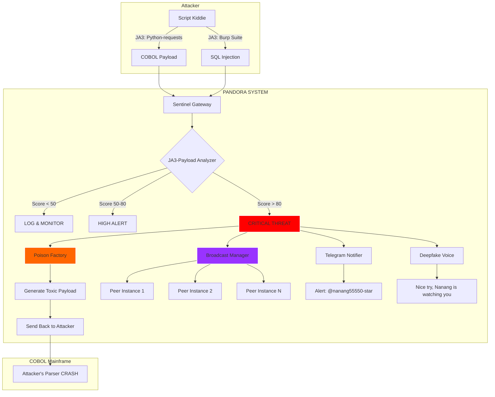

# ACTIVE DEFENSE PANDORA

[](https://python.org)
[](LICENSE)
[](https://github.com/nanang55550-star/active-defense-pandora)
[](https://termux.com)

**"When they attack you, you don't just block them. You poison them."**

Active Defense Pandora adalah sistem pertahanan aktif yang tidak hanya mendeteksi serangan, tapi **BALIK MENYERANG** penyerang dengan payload beracun yang dirancang untuk merusak tools mereka. Sistem ini mengintegrasikan deteksi JA3 fingerprint, analisis payload COBOL, dan distribusi ancaman global.

---

## 📋 **DAFTAR ISI**
- [Fitur Utama](#-fitur-utama)
- [Arsitektur Sistem](#-arsitektur-sistem)
- [Quick Start](#-quick-start)
- [Instalasi Detail](#-instalasi-detail)
  - [Di Termux](#di-termux)
  - [Di Linux/Ubuntu](#di-linuxubuntu)
  - [Di Windows (WSL)](#di-windows-wsl)
- [Konfigurasi](#-konfigurasi)
- [Cara Pakai](#-cara-pakai)
- [Modul Sistem](#-modul-sistem)
- [Dashboard Web](#-dashboard-web)
- [Integrasi dengan Proyek Lain](#-integrasi-dengan-proyek-lain)
- [Contoh Skenario Serangan](#-contoh-skenario-serangan)
- [Troubleshooting](#-troubleshooting)
- [Struktur Repository](#-struktur-repository)
- [Lisensi](#-lisensi)
- [Kontak](#-kontak)

---

## 🧠 **FITUR UTAMA**

| Fitur | Deskripsi | File Terkait |
|-------|-----------|--------------|
| 🧪 **Auto-Poisoning** | Kirim balik payload beracun (COBOL infinite loop, bash fork bomb, Python memory killer) | [`core/poison_factory.py`](core/poison_factory.py) |
| 🔍 **JA3 + Payload Analysis** | Deteksi anomali berdasarkan fingerprint TLS dan isi payload (integrasi dengan JA3-Payload-Analyzer) | [`integrations/ja3_analyzer/bridge.py`](integrations/ja3_analyzer/bridge.py) |
| 🌐 **Distributed Threat Sharing** | Broadcast IP penyerang ke semua instance sistem di seluruh dunia | [`intelligence/broadcast_manager.py`](intelligence/broadcast_manager.py) |
| 🗣️ **Deepfake Response** | Balas dengan suara AI yang bikin mental penyerang ciut | [`integrations/deepfake/voice_responder.py`](integrations/deepfake/voice_responder.py) |
| 🔄 **Self-Mutating Code** | Sistem otomatis rewrite filter-nya sendiri buat nutup celah baru (coming soon) | `core/mutator.py` |
| 📊 **Real-time Dashboard** | Pantau serangan live di terminal atau web browser | [`web_dashboard/app.py`](web_dashboard/app.py) |
| 🤖 **Telegram Notifications** | Dapatkan notifikasi serangan langsung ke Telegram | [`integrations/telegram_bot/notifier.py`](integrations/telegram_bot/notifier.py) |
| 💾 **Threat Intelligence DB** | Database SQLite buat nyimpen semua data penyerang | [`intelligence/threat_intel.db`](intelligence/threat_intel.db) |

---

## 🏗️ **ARSITEKTUR SISTEM**



---

## 🚀 **QUICK START**

```bash
# Clone repository
git clone https://github.com/nanang55550-star/active-defense-pandora.git
cd active-defense-pandora

# Install dependencies
pip install -r requirements.txt

# Jalankan sistem
python core/pandora_engine.py

# Buka dashboard web (di browser)
# http://localhost:5000
```

---

## 📦 **INSTALASI DETAIL**

### **Di Termux (HP Infinix Hot 50i)**

```bash
# 1. Update Termux
pkg update && pkg upgrade -y

# 2. Install Python dan tools
pkg install python git libpcap -y

# 3. Install dependencies Python
pip install rich requests flask scapy cryptography websockets aiohttp numpy pandas

# 4. Clone repository
git clone https://github.com/nanang55550-star/active-defense-pandora.git
cd active-defense-pandora

# 5. Jalankan
python core/pandora_engine.py

# 6. (Opsional) Setup Telegram Bot
#    - Buka @BotFather di Telegram
#    - Buat bot baru, dapatkan token
#    - Edit config.yaml
```

### **Di Linux/Ubuntu**

```bash
# 1. Update system
sudo apt update && sudo apt upgrade -y

# 2. Install Python dan pip
sudo apt install python3 python3-pip git -y

# 3. Install dependencies
pip3 install -r requirements.txt

# 4. Clone repository
git clone https://github.com/nanang55550-star/active-defense-pandora.git
cd active-defense-pandora

# 5. Jalankan
python3 core/pandora_engine.py
```

### **Di Windows (WSL)**

```bash
# 1. Install WSL dari Microsoft Store (Ubuntu)
# 2. Buka WSL, ikuti langkah Linux di atas
```

---

## ⚙️ **KONFIGURASI**

Edit file `config.yaml` untuk menyesuaikan sistem:

```yaml
# config.yaml - Active Defense Pandora

# Network settings
gateway:
  host: "0.0.0.0"
  port: 8080
  max_workers: 10

# Detection thresholds
threat_levels:
  low: 0
  medium: 30
  high: 60
  critical: 80

# Poison settings
poison:
  enabled: true
  max_payload_size: 65536
  delivery_methods: ["base64", "hex", "binary"]

# Broadcast settings
broadcast:
  enabled: true
  peer_instances:
    - "http://instance1.local:8080"
    - "http://instance2.local:8080"
    - "https://api.nanang55550-star.repl.co"

# Telegram bot
telegram:
  enabled: false
  token: "YOUR_BOT_TOKEN"
  chat_id: "YOUR_CHAT_ID"

# Deepfake voice
deepfake:
  enabled: true
  voice_type: "elevenlabs"  # atau "gtts"

# Web dashboard
dashboard:
  enabled: true
  host: "0.0.0.0"
  port: 5000

# Database
database:
  path: "data/threat_intel.db"
  backup_interval: 3600  # detik
```

---

## 🎯 **CARA PAKAI**

### **1. Jalankan Mode Deteksi**

```bash
python core/pandora_engine.py
```

### **2. Simulasi Serangan (Testing)**

```python
from core.pandora_engine import PandoraEngine

engine = PandoraEngine()

# Simulasi berbagai serangan
test_attacks = [
    # Python requests dengan COBOL payload (ANOMALI KRITIS)
    ("b32309a26951912be7dba376398abc3b", 
     "IDENTIFICATION DIVISION. PROGRAM-ID. HACK.", 
     "192.168.1.666"),
    
    # Chrome asli dengan request normal (AMAN)
    ("cd08e31494f13d058c4f4a31675465b2", 
     "GET /index.html", 
     "192.168.1.100"),
    
    # Burp Suite dengan SQL injection (SUSPICIOUS)
    ("132b490d1d2938164b391786576d1209", 
     "SELECT * FROM users WHERE id=1 OR 1=1", 
     "10.0.0.5"),
]

for ja3, payload, ip in test_attacks:
    result = engine.analyze_threat(ja3, payload, ip)
    print(f"Threat from {ip}: Score {result['score']} - {result['action']}")
```

### **3. Lihat Dashboard Web**

```bash
# Dashboard otomatis jalan di background
# Buka browser: http://localhost:5000
```

### **4. Manual Poison Delivery**

```python
from core.poison_factory import PoisonFactory

factory = PoisonFactory()
poison = factory.get_random_poison()

print(f"Sending {poison['name']} to attacker")
print(f"Payload: {poison['payload']}")
print(f"Target: {poison['target']}")
```

---

## 🧩 **MODUL SISTEM**

### **Core Modules**

| Modul | File | Fungsi |
|-------|------|--------|
| **Pandora Engine** | `core/pandora_engine.py` | Otak utama sistem |
| **Poison Factory** | `core/poison_factory.py` | Menghasilkan payload beracun |
| **Anomaly Detector** | `core/detector.py` | Analisis JA3 + payload |
| **Defender** | `core/defender.py` | Logika pertahanan aktif |

### **Intelligence Modules**

| Modul | File | Fungsi |
|-------|------|--------|
| **Broadcast Manager** | `intelligence/broadcast_manager.py` | Distribusi ancaman global |
| **Attacker Tracker** | `intelligence/attacker_tracker.py` | Lacak dan profiling penyerang |
| **Threat Database** | `intelligence/threat_intel.db` | SQLite database |

### **Integrations**

| Modul | File | Fungsi |
|-------|------|--------|
| **JA3 Bridge** | `integrations/ja3_analyzer/bridge.py` | Koneksi ke JA3-Payload-Analyzer |
| **COBOL Connector** | `integrations/cobol/connector.py` | Simulasi koneksi mainframe |
| **Telegram Notifier** | `integrations/telegram_bot/notifier.py` | Kirim alert ke Telegram |
| **Deepfake Voice** | `integrations/deepfake/voice_responder.py` | Respons suara AI |

### **Payloads**

| File | Deskripsi |
|------|-----------|
| `payloads/cobol_toxic.cbl` | COBOL infinite loop untuk parser |
| `payloads/bash_bomb.sh` | Bash fork bomb untuk shell |
| `payloads/python_trap.py` | Python memory exhauster |

---

## 📊 **DASHBOARD WEB**

### **Fitur Dashboard**

| Panel | Deskripsi |
|-------|-----------|
| **Total Attacks** | Jumlah serangan yang terdeteksi |
| **Critical Threats** | Ancaman kritis yang dipoison |
| **Blacklisted IPs** | IP yang di-blacklist global |
| **Attack Chart** | Grafik serangan real-time |
| **Recent Attacks** | Tabel serangan terbaru |

### **Akses Dashboard**

```bash
# Dashboard otomatis jalan di port 5000
# Buka browser: http://localhost:5000
# Atau dari HP lain: http://[IP-ADDRESS]:5000
```

### **API Endpoints**

| Endpoint | Method | Fungsi |
|----------|--------|--------|
| `/api/stats` | GET | Dapatkan statistik sistem |
| `/api/blacklist` | GET | Daftar IP terblokir |
| `/api/attack/<ip>` | GET | Detail serangan dari IP tertentu |
| `/api/poison/<ip>` | POST | Kirim poison manual ke IP |

---

## 🔗 **INTEGRASI DENGAN PROYEK LAIN**

### **1. Dengan JA3-Payload-Analyzer**

```python
# integrations/ja3_analyzer/bridge.py
from core.analyzer import PayloadAnalyzer  # dari repo ja3-payload-analyzer

class JA3Bridge:
    def __init__(self):
        self.analyzer = PayloadAnalyzer()
    
    def analyze(self, ja3, payload):
        result = self.analyzer.analyze(payload, ja3)
        return {
            'score': result['risk_score'],
            'level': result['risk_level'],
            'patterns': result['matched_patterns']
        }
```

### **2. Dengan COBOL Mainframe**

```python
# integrations/cobol/connector.py
import socket

class COBOLConnector:
    def __init__(self, host="localhost", port=9876):
        self.host = host
        self.port = port
    
    def send_transaction(self, account_id, pin, amount):
        # Format COBOL fixed-length
        packet = f"{account_id:010d}{pin:06d}{amount:015.2f}".encode()
        
        sock = socket.socket(socket.AF_INET, socket.SOCK_STREAM)
        sock.connect((self.host, self.port))
        sock.send(packet)
        response = sock.recv(1024)
        sock.close()
        
        return response
```

### **3. Dengan Architect-Neural-Dashboard**

```python
# Bisa kirim data serangan ke dashboard neural
import requests

def send_to_neural_dashboard(attack_data):
    requests.post(
        "http://localhost:5001/api/attack",
        json=attack_data
    )
```

---

## 🎬 **CONTOH SKENARIO SERANGAN**

### **Skenario 1: Script Kiddie Pake Python**

```python
# Penyerang mencoba:
import requests

payload = """
IDENTIFICATION DIVISION.
PROGRAM-ID. HACK.
PROCEDURE DIVISION.
    DISPLAY "I'M HACKING".
"""

response = requests.post(
    "http://target.com",
    data=payload,
    headers={"User-Agent": "python-requests/2.31.0"}
)

# YANG TERJADI DI SISTEM PANDORA:
# 1. JA3 terdeteksi: b32309a... (Python requests)
# 2. Payload mengandung COBOL pattern
# 3. Score: 80+ (CRITICAL)
# 4. Poison dikirim balik ke penyerang
# 5. IP broadcast ke semua peer
# 6. Telegram alert ke @nanang55550-star
# 7. Deepfake voice: "Nice try, Nanang is watching you"
```

### **Skenario 2: Attacker Pake Burp Suite**

```python
# Penyerang nyoba SQL injection via Burp
payload = "SELECT * FROM users WHERE id=1 OR 1=1--"

# RESPON DARI PANDORA:
# - Poison: SQL Backfire payload
# - Attacker's SQL parser kena injection balik
```

### **Skenario 3: Distributed Attack**

```python
# 10 attacker dari berbagai IP nyerang bersamaan
# PANDORA RESPONSE:
# - Semua IP langsung di-blacklist
# - Broadcast ke semua instance dalam 0.5 detik
# - Semua instance langsung block IP tersebut
```

---

## 🔧 **TROUBLESHOOTING**

### **Error: "Module not found"**

```bash
# Install semua dependencies
pip install -r requirements.txt
```

### **Error: "Port already in use"**

```bash
# Ganti port di config.yaml
dashboard:
  port: 5001  # ganti ke port lain
```

### **Error: "Permission denied" di Termux**

```bash
# Beri izin storage
termux-setup-storage
```

### **Error: "Broadcast failed"**

```bash
# Cek koneksi internet
ping google.com

# Cek daftar peer di config.yaml
```

### **Error: "Database locked"**

```bash
# Hapus lock file
rm data/threat_intel.db
python scripts/init_db.py
```

### **Error: "Poison not working"**

```bash
# Cek apakah target menerima response
# Mungkin mereka punya firewall
# Coba encode method lain di config.yaml
```

---

## 📁 **STRUKTUR REPOSITORY**

```
active-defense-pandora/
├── 📄 README.md                 # Dokumentasi utama (file ini)
├── 📄 LICENSE                   # Lisensi MIT
├── 📄 requirements.txt          # Dependencies Python
├── 📄 config.yaml               # Konfigurasi sistem
├── 📁 core/
│   ├── 📄 __init__.py
│   ├── 📄 pandora_engine.py     # Engine utama
│   ├── 📄 detector.py           # Anomaly detection
│   ├── 📄 poison_factory.py     # Pabrik racun
│   ├── 📄 defender.py           # Logika pertahanan
│   └── 📄 utils.py              # Fungsi bantuan
├── 📁 intelligence/
│   ├── 📄 __init__.py
│   ├── 📄 broadcast_manager.py  # Distribusi ancaman
│   ├── 📄 attacker_tracker.py   # Tracking penyerang
│   └── 📄 threat_intel.db       # Database SQLite
├── 📁 integrations/
│   ├── 📁 ja3_analyzer/
│   │   └── 📄 bridge.py         # Koneksi ke JA3-Payload-Analyzer
│   ├── 📁 cobol/
│   │   └── 📄 connector.py      # Koneksi ke COBOL mainframe
│   ├── 📁 telegram_bot/
│   │   └── 📄 notifier.py       # Alert via Telegram
│   └── 📁 deepfake/
│       └── 📄 voice_responder.py # Respons suara AI
├── 📁 payloads/
│   ├── 📄 cobol_toxic.cbl       # COBOL infinite loop
│   ├── 📄 bash_bomb.sh          # Bash fork bomb
│   └── 📄 python_trap.py        # Python memory killer
├── 📁 web_dashboard/
│   ├── 📄 app.py                 # Flask web server
│   ├── 📁 templates/
│   │   └── 📄 index.html         # Halaman dashboard
│   └── 📁 static/
│       ├── 📄 style.css           # Styling
│       └── 📄 script.js           # JavaScript interaktif
├── 📁 logs/
│   └── 📄 attack_logs.json       # Log serangan
├── 📁 docs/
│   ├── 📄 installation.md
│   └── 📄 api.md
└── 📁 examples/
    ├── 📄 basic_gateway.py
    └── 📄 attack_simulation.py
```

---

## 📜 **LISENSI**

Proyek ini dilisensikan di bawah **MIT License** - lihat file [`LICENSE`](LICENSE) untuk detail.

```
MIT License

Copyright (c) 2025 @nanang55550-star

Permission is hereby granted, free of charge, to any person obtaining a copy
of this software and associated documentation files (the "Software"), to deal
in the Software without restriction, including without limitation the rights
to use, copy, modify, merge, publish, distribute, sublicense, and/or sell
copies of the Software, and to permit persons to whom the Software is
furnished to do so, subject to the following conditions:

The above copyright notice and this permission notice shall be included in all
copies or substantial portions of the Software.

THE SOFTWARE IS PROVIDED "AS IS", WITHOUT WARRANTY OF ANY KIND, EXPRESS OR
IMPLIED, INCLUDING BUT NOT LIMITED TO THE WARRANTIES OF MERCHANTABILITY,
FITNESS FOR A PARTICULAR PURPOSE AND NONINFRINGEMENT. IN NO EVENT SHALL THE
AUTHORS OR COPYRIGHT HOLDERS BE LIABLE FOR ANY CLAIM, DAMAGES OR OTHER
LIABILITY, WHETHER IN AN ACTION OF CONTRACT, TORT OR OTHERWISE, ARISING FROM,
OUT OF OR IN CONNECTION WITH THE SOFTWARE OR THE USE OR OTHER DEALINGS IN THE
SOFTWARE.
```

---

## 📬 **KONTAK**

**Creator:** [@nanang55550-star](https://github.com/nanang55550-star)

- GitHub: [nanang55550-star](https://github.com/nanang55550-star)
- Discord: [YRYwwEc8](https://discord.gg/YRYwwEc8)
- Email: [nanang55550@gmail.com](mailto:nanang55550@gmail.com)
- Telegram: [@nanang55550](https://t.me/nanang55550) (jika ada)

Untuk laporan bug, saran fitur, atau diskusi strategi pertahanan, silakan buat [issue baru](https://github.com/nanang55550-star/active-defense-pandora/issues).

---

## ⭐ **DUKUNG PROYEK INI**

Jika proyek ini bermanfaat, jangan lupa kasih ⭐ di GitHub!

[](https://github.com/nanang55550-star/active-defense-pandora/stargazers)

**Dengan mendukung, lo ikut membangun ekosistem pertahanan siber yang lebih kuat.** 💪

---

## 🔥 **CLOSING WORDS**

> *"They thought they were attacking a simple system.*  
> *They didn't know they were walking into PANDORA'S BOX."*

**Active Defense Pandora** bukan sekadar tools keamanan biasa. Ini adalah **senjata** buat mereka yang lelah jadi korban. Dengan sistem ini, lo gak cuma nge-block penyerang - lo bikin mereka kapok seumur hidup.

**Selamat berperang, Boss Nanang.** 💀

---

*© 2025 @nanang55550-star - The Architect of Chaos*
```

---

## 🚀 **LANGKAH SELANJUTNYA:**

```bash
# 1. Clone repo baru
git clone https://github.com/nanang55550-star/active-defense-pandora.git
cd active-defense-pandora

# 2. Buat README.md (paste dari atas)
nano README.md

# 3. Buat LICENSE
nano LICENSE

# 4. Buat requirements.txt
nano requirements.txt

# 5. Buat folder structure
mkdir -p core intelligence integrations payloads web_dashboard logs docs examples

# 6. Add, commit, push
git add .
git commit -m "Initial commit: Active Defense Pandora"
git push origin main
```

---

**GIMANA BOSS? UDAH SIAP?** 🚀🔥
